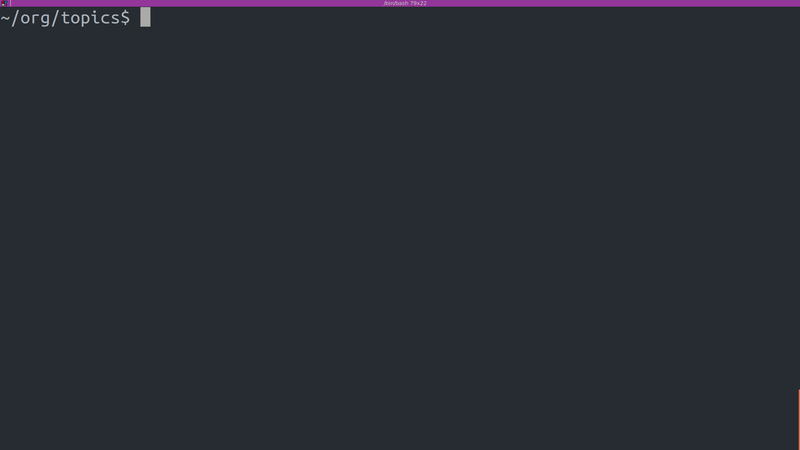

<h1>Debounce Grep</h2>

This is a program that lets the user search files like with `grep` but debounces the search as the user types the search term. I wrote it to help me quickly find terms in files of notes that I take but it can be used for code as well.

The UI is terminal-based and is somewhat [React](https://reactjs.org/)-inspired as the different "elements"- paths of the files with matches, text in the files that contain the matches - are represented in the program by objects that are passed their state from "parent" elements and that each have a `render()` method.

<h3>Installation</h3>

1. `go get github.com/lsimmons2/debounce-grep`

2. `cd $GOPATH/src/github.com/lsimmons2/debounce-grep/debounce-grep`

3. `go install`

<h3>Usage</h3>

`$debounce_grep` (or whatever alias you like - I use `dg`)

As you type, files that contain the search term will appear below the prompt where the search term is being typed. You then navigate them by using `Ctrl-j` (down) and `Ctrl-k` (up) and open and close them with `Ctrl-Space` to see the matches highlighted in the file text. The search term being typed can be traversed with `Ctrl-f` (forward) and `Ctrl-b` (backwards). These keyboard shortcuts are vim/emacs-inspired and are currently hard-coded.

<h3>Demo</h3>

 

<h3>Config options</h3>

Each config option can be specified with flags or environmental variables. Flags will override environmental variables and if neither a flag nor an environmental variable is specified for an option a default value will be used. For config options that can take multiple values you can either pass multiple flags (`--ignore .git --ignore *.pyc`) or have multiple values in an environmental variable separated by `:` (`export DEBOUNCE_GREP_PATTERNS_TO_IGNORE=".git:*.pyc`). Flags can be specified in any of the following, equivalent, syntaxes: `-ignore=*.pyc`, `-ignore *.pyc`, `--ignore=*.pyc`, or `--ignore *.pyc`.

| Option | Environmental Variable | Flag | Default value | Multiple Values | Description |
| ------------- | ------------- | ------------- | ------------- | ------------- | ------------- |
| Debounce Time (ms)  | `DEBOUNCE_GREP_DEBOUNCE_TIME_MS`  | `ms`  | `200`  | No | Time that program will wait after last character is typed before searching files.  |
| Max Lines to Print Per Matched File  | `DEBOUNCE_GREP_MAX_LINES_PER_FILE`  | `lines`  | `5`  | No | Maximum number of lines with matches that will be shown for each file.  |
| Directories to Search  | `DEBOUNCE_GREP_DIRS_TO_SEARCH`  | `dir`  | Current working directory  | Yes | Directories to search. |
| File Shebangs  | `DEBOUNCE_GREP_FILE_SHEBANGS`  | `shebang`  | None - files do not need a shebang to be searched | Yes  | "Shebangs" that files will need to be searched. I put in because I store a lot of my notes in files with a `*study` shebang at the top of the file and often use this program for searching just these files.  |
| Patterns of Files/Directories to Ignore  | `DEBOUNCE_GREP_PATTERNS_TO_IGNORE`  | `ignore`  | `.git`, `venv`, `node_modules`, `bower_components`, `*.png`, `*.jpg`, `*.jpeg`, and `*.pyc`  | Yes | Glob patterns to specify files and directories not to search. Follows standard described [here](http://pubs.opengroup.org/onlinepubs/009695399/utilities/xcu_chap02.html#tag_02_13). |
| Should Print Whole Lines  | `DEBOUNCE_GREP_PRINT_WHOLE_LINES`  | `whole-lines`  | `false`  | No | Whether to print the entire length of each file line with a match in it. If false, text will be cut off at the end of the terminal window. |
